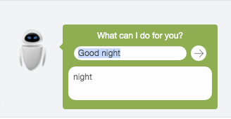

# Eve
聊天机器人Eve  - 核心代码

- 支持英语环境下的简单地自动回复、聊天等，类似于小黄鸡。
- 支持训练教学模式（脚本或者手工）
- 包含简单词库、分词、解析部分的逻辑代码等，在controller/core 目录中

[点击访问Eve，跟她聊起来](http://robot.karat.cc/) http:robot.karat.cc



### 如何使用教学模式

－ 通过`::`符号来间隔问题和答案

````Javascript
Q::A
```
Like:
````Javascript
Tell me you age::I am 13 now
```
